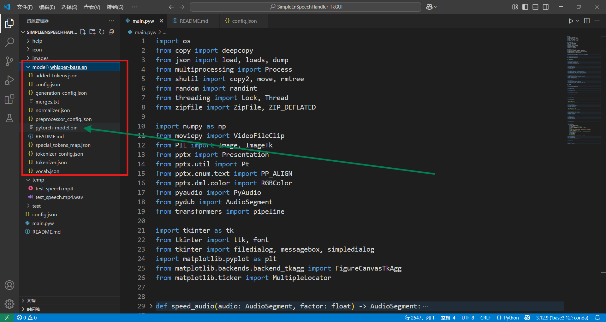
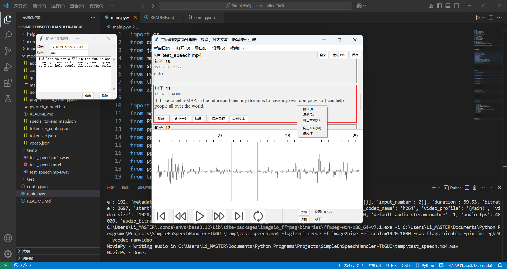

# SimpleEnSpeechHandler-TkGUI

A Python-based GUI tool for processing English speech audio/video files, aligning text with timestamps, and generating customizable dictation exercises in PowerPoint format. Built with Tkinter and powered by Hugging Face's speech recognition models.

(Following paragraphes are mainly generated by DeepSeek-R1 - or it'll be tiring for me yo do that.)  
([For ordinary users, please skip to the last part for a hand-by-hand guide.](#jump1))


## Core Features

1. **Speech-to-Text Alignment**  
   - Automatically recognize speech in audio/video files (MP3/WAV/FLAC/M4A/MP4/MKV/AVI...)
   - Generate precise text-timestamp pairs for each sentence
   - Support video-to-audio extraction

2. **Audio Visualization & Playback**  
   - Waveform preview with timestamp markers
   - Interactive playback controls:
     - Play/pause
     - Skip sentences
     - Adjustable fast-forward/rewind intervals
   - Real-time playback position tracking
   - Jump to sentences freely

3. **Dictation PPT Generator**  
   - Create customizable PowerPoint slides:
     - Single-sentence mode with repeat options
     - Paragraph mode for long text
     - Adjustable playback speed
     - Auto-include answer slides
   - Export PPTX with embedded audio controls


## Key Highlights

### Advanced Editing Tools
- **Manual calibration**: Split/merge sentences, edit timestamps/text
- **Context-aware waveform editor**: Visual timestamp adjustment
- **Real-time text sync**: Highlight currently playing sentence

### Export Flexibility
- **Custom audio slicing**: Combine clips with pauses/speed adjustments
- **Text export**: Full transcript in TXT format
- **Project snapshot**: Save/load work progress as ZIP archives

### Customization
- **Model switching**: Compatible with Hugging Face ASR models
- **Hotkey support**: Streamlined workflow
- **Configurable UI**: Adjust refresh rates/playback intervals

### Enhanced UX
- Scrollable sentence panel
- Right-click context menus
- Auto-wrapping text display
- Multi-window support
- Comprehensive help documentation


## Installation & Usage

### Requirements
- Python 3.11+
- FFmpeg (for video processing)

### Dependencies
```bash
pip install moviepy python-pptx pydub pyaudio transformers numpy matplotlib pillow
```

---


### <span id="jump1">Chinese Installation Guide (中文安装教程)</span>

稍后你可能会在 Release 中看到作者使用 pyinstaller 打包好的 .exe 可执行文件，这种点击即可运行。
但在那个东西准备并上传好之前，可能需要你亲手配置一个合适的 Python 环境。  
对此我真的很抱歉，但我会编写一套详细的图文教程，请看：

1. **Python 安装**

   如果你已经安装好了 Python 解释器，请跳过此步骤。

   1. 
      Python 语言编写的程序，需要 Python 的解释器来运行，正如 java 需要自己的解释器一样。所以我们现在要去官网下载一个。
      

      前往官网（此处为 Windows 版本）下载适合的版本：
      [https://www.python.org/downloads/windows/](https://www.python.org/downloads/windows/ "Python for Windows")

   2. 
      运行安装程序。
      

      为了避免不必要的麻烦，请勾选 `Add python.exe to PATH`，将其添加到环境变量中。  
      除此之外，一直点首选项和确认即可。
   
2. **第三方库安装**

      第三方库就像 minecraft 里的模组（mod），加了它你能做一些原版实现起来很麻烦的功能。

      为了安装库，我们需要使用 pip 安装。而 pip 可以是一个命令行工具，对于 Windows 用户，请打开命令行并输入以下安装指令。  
      （一般情况下，使用快捷键 `Win+R` 并键入 `cmd` 即可）

      ```bash
      pip install moviepy python-pptx pydub pyaudio transformers numpy matplotlib pillow
      ```

      如果是国内用户，这么做肯定很慢且很容易失败，所以我们要用镜像站下载。  
      请使用这个指令：
      ```bash
      pip install moviepy python-pptx pydub pyaudio transformers numpy matplotlib pillow -i https://pypi.tuna.tsinghua.edu.cn/simple
      ```
      
      此后，请耐心等待下载完成。

3. **安装其他支持**

   1. 
      第一个需要的支持是 ffmpeg，这是一个跨平台音视频流处理支持，广泛运用在各种项目中，如果你没有安装过，请按照以下步骤来：

      

      下载链接（大概有点慢吧）：  
      [https://www.gyan.dev/ffmpeg/builds/ffmpeg-release-full.7z](https://www.gyan.dev/ffmpeg/builds/ffmpeg-release-full.7z "下载稳定版")

      ---

      下载完后，请解压到一个你认为合适的文件夹，并复制该文件夹中解压后的 lib 文件夹路径。

      在电脑设置中找到 `系统环境变量`，选择 `PATH` 环境变量（不分大小写），点击 `编辑`，再新建一栏填充你刚才复制的路径。

      如果不想配置环境变量，直接将解压后的文件全部倾倒进 `C:\\System32` 即可（不要额外创建新文件夹）。

   2. 
      第二个需要的依赖项是一个 Hugging Face 的模型，这里首选 Whisper-base.en。（以此为例）

      国内用户这里不推荐使用官网下载，我们去镜像下载：
      

      请下载好框选的文件，然后保存到本工具的项目文件夹中的 `model\whisper-base.en` 文件夹中，具体结构如下：

      

---

现在大概已经完成了所有准备工作，<u>点击 `main.pyw` 即可运行本项目！</u>

下面是一些使用快照：


 ↑ 打开一个音/视频文件


 ↑ 使用底部播放控件调整播放位置，同时可以点击 `全文` 按钮呼出同步文本高亮窗口
 

 ↑ 点击一个句子，可以选中它并显示详细操作面板。此时右键还可以呼出右键菜单。
 

 ↑ 点击 `切割` 按钮可以在当前播放位置将此处的句子断为两截。


 ↑ 你可以通过红框标注的入口保存你的工作项目，并随之通过 `顶部菜单->打开(O)->还原存档(R)` 来恢复当前进程。  
 工作项目存档包含了当前的文本和句子划分，以及原本的音/视频文件，所以只需要点击即可完全恢复。
 

 ↑ 点击 `PPT 生成`，会呼出一个载入了默认设置的 PPT 生成参数调节界面，你可以自己调节参数。点击 `生成` 即可导出一份 PPT。  
 注意！该 PPT 不需要依赖项，因为所有需要的媒体内容都放进来 PPT 本体中。


 ↑ 如果想按照自定义规则导出一段特制的视频，请在 `顶部菜单->导出(E)->导出音频切片(A)` 根据提示输入。


---

以上，感谢！

